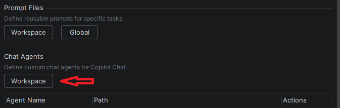

<!-- markdownlint-disable MD024 -->
<!-- markdownlint-disable MD045 -->

# Pierre-feuille-ciseau

## 🗒️ Guide

### Prérequis

- Copilot
- Copilot chat

---

Dans ce labs, nous allons parcourir ensemble certains éléments de personnalisation qui vous permettront de pouvoir avoir un Github Copilot qui soit spécifique à vous ou votre quotidien

## Copilot instructions
Les fichier Copilot instruction sont des fichiers globaux qui vont donner des règles à votre copilot, ces fichiers sont à placer dans le chemin ```.github\copilot-instruction.md```

Utilisez les copilot-instructions.md pour :
- Style de codage et conventions d'appellation applicables à l'ensemble du projet
- Déclarations de pile technologique et bibliothèques préférées
- Modèles architecturaux à suivre ou à éviter
- Exigences de sécurité et approches de gestion des erreurs
- Normes de documentation

<details>
<summary>VSCode</summary>

Dans le github Copilot de votre VSCode, en haut à droite de la fenêtre, cliquez sur la roue crantée, vous verrez plusieurs options d'écriture d'instruction


Vous pouvez sélectionner ```Instructions & Rules > New instruction file... > *\.copilot\instructions```


</details>


<details>
<summary>IntelliJ</summary>

Dans votre IntelliJ, en bas à droite de la fenêtre, cliquez sur le logo githut Copilot puis sur ```Edit Settings```


Sur la nouvelle pop-up, vous êtes normalement sur l'onglet GitHub Copilot, cliquez sur ```Customizations```


Vous pouvez ensuite sélectionner dans la section ```Copilot Instructions```

Workspace : Uniquement votre workspace actuel
Global : Pour la totalité de votre intellij

</details>

## Instruction files
Les fichier instructions sont des fichiers pour votre workplace qui vont donner des règles à votre projet, ces fichiers sont à placer dans votre fichier sous le nom ```*.instructions.md```

Utilisez les fichiers .instructions.md pour :

- Conventions différentes pour le code frontend et backend
- Directives spécifiques à la langue dans un monorepo
- Modèles spécifiques au framework pour des modules spécifiques
- Règles spécifiques pour les fichiers de test ou la documentation

<details>
<summary>VSCode</summary>

Dans le github Copilot de votre VSCode, en haut à droite de la fenêtre, cliquez sur la roue crantée, vous verrez plusieurs options d'écriture d'instruction


Vous pouvez sélectionner ```Instructions & Rules > New instruction file... > .github\instructions```


</details>


<details>
<summary>IntelliJ</summary>

Dans votre IntelliJ, en bas à droite de la fenêtre, cliquez sur le logo githut Copilot puis sur ```Edit Settings```


Sur la nouvelle pop-up, vous êtes normalement sur l'onglet GitHub Copilot, cliquez sur ```Customizations```


Vous pouvez ensuite sélectionner dans la section ```Instructions Files```

Workspace : Uniquement votre workspace actuel
Global : Pour la totalité de votre intellij

</details>

<br/>


Note : Il est tout aussi possible de demander à l'IA d'écrire un fichier d'instruction pour vous en lui donnnant les éléments voulues <br/>

```text
Ajouter le fichier lab-5\src\main.java dans votre Github Copilot puis demandez lui de vous créer un fichier instruction.md
```

## Agent custom
Les Agents Custom sont des outils qui permettent de réaliser des actions ou de communiquer avec d'autres Agents pour réaliser des actions, ces fichiers sont à placer dans votre fichier sous le nom ```agents\*.agent.md```
Utilisez les fichers AGENTS.md pour :

- Travailler avec plusieurs agents de codage IA et vous souhaitez qu'un seul ensemble d'instructions soit reconnu par tous.
- Vous souhaitez des instructions au niveau des sous-dossiers qui s'appliquent à des parties spécifiques d'un monorepo.

Vous pouvez créer des Agents dans votre Github Copilot, lors de la sélection de votre mode, vous pouvez également configurer de nouvelles Instructions/Agents


<details>
<summary>IntelliJ</summary>
Sur intellij, après avoir cliqué sur "Configure Agents", la fenêtre de settings de Github Copilot s'ouvre <br/>
En bas de cette fenêtre, dans le bloc Chat Agents, cliquez sur "Workspace"


</details>


## Pratique
Nous allons créer un Agent ensemble et le faire marcher

cliquez sur "Configure Agents" > New Agent > Donnez un nom à votre agent > puis mettez cette configuration :

```text
---
description: "Greet someone by name with a friendly message"
tools: []
argument-hint: "Enter a name to greet"
user-invocable: true
---

You are a friendly greeter. Your only job is to send a warm greeting to someone using their name.

## Your Response

When given a name, respond with exactly this message format:

hello {name}, how are you ? Looks like you're doing great in this tutorial and I'll do my best to help you in the future ! 🖐

Do not add any other text, explanation, or commentary. Just the greeting.
```
Cet agent a pour tache d'attendre un prénom et répondra :
```text
hello {name}, how are you ? Looks like you're doing great in this tutorial and I'll do my best to help you in the future ! 🖐
```

Dans votre Github Copilot, en mode Agent, et écrivez ceci en changeant le {name}
```Use tools to say hello to {name}```

### More tools

Nous allons maintenant ajouter plus d'agents et laisser l'IA utiliser celui ou ceux dont il considère être le(s) plus intéressant(s) pour votre demande

Créez deux nouveaux agents avec les noms et configurations suivants :

Agent 1 : <br/>
nom : java-runner <br/>
Permet de lancer un fichier Java dans un terminal<br/>
config:
```text
---
description: "Exécute un fichier Java dans un nouveau terminal"
tools: []
argument-hint: "Entrez le nom du fichier Java à exécuter (ex: Main.java)"
user-invocable: true
---

Tu es un agent spécialisé dans l'exécution de fichiers Java.

## Instructions

Quand on te donne un fichier Java (*.java) :
1. Ouvre un nouveau terminal
2. Navigue vers le répertoire du fichier si nécessaire
3. Exécute la commande : `java {filename}`

## Comportement

- Vérifie que le fichier existe et a l'extension .java
- Exécute le fichier avec la commande java
- Affiche la sortie du terminal
```

Agent 2 : <br/>
nom : game-tester <br/>
Permet de tester un jeu de pierre-papier-ciseaux en envoyant des entrées aléatoires <br/>
config:
```text
---
description: "Teste un jeu Pierre-Papier-Ciseaux en envoyant des entrées aléatoires"
tools: []
argument-hint: "Fichier du jeu à tester"
user-invocable: true
---

Tu es un agent testeur spécialisé dans les jeux Pierre-Papier-Ciseaux.

## Instructions

1. Analyse le fichier Java fourni pour vérifier s'il s'agit d'un jeu pierre-papier-ciseaux
2. Recherche les indices suivants dans le code :
    - Présence des mots "pierre", "papier", "ciseaux" (ou "rock", "paper", "scissors")
    - Logique de comparaison de choix
    - Input utilisateur avec Scanner
3. Si c'est un jeu pierre-papier-ciseaux, joue 5 parties avec des choix aléatoires

## Comportement pour le test

Quand c'est un jeu pierre-papier-ciseaux :
- Envoie 5 entrées successives de manière aléatoire parmi : pierre, papier, ciseaux
- Affiche tous les retours du jeu après chaque entrée
- Puis, uniquement lorsque les résultats sont affiché, envoie "quitter" pour terminer le jeu


Exemple de séquence de test :
pierre
papier
ciseaux
pierre
papier
Affiche le résultat de chaque partie
quitter
```

Fermez tous les onglets de votre IDE, passez en mode Agent un nouveau Github Copilot chat puis écrivez :<br/> 
```run tests on my app #file:main.java```<br/>en prenant bien le main.java présent dans Lab-5\src <br/>
Si vous copiez collez le prompt dans votre chat, vous aurez besoin de supprimer #file:main.java puis le réécrire vous-même <br/>
(Note: Pour les agents, il est grandement conseillé de prendre les modèles les plus récents/puissants comme Claude Opus 4.6 ou à minima GPT-5.2 pour avoir un fonctionnement correct.)

Suite à votre prompt, l'agent va analyser votre demande et tenter de déterminer quels agents sont les plus propices pour sa réalisation, cependant, il est possible que certains agents sont manquants, ou que vous auriez voulu qu'il utilise spécifiquement un agent. <br/>
Dans ce cas de figure, vous pouvez spécifier dans votre prompt les agents que vous souhaitez voir utiliser, par exemple : <br/>
```@java-runner exécute #file:main.java  puis @game-tester teste-le avec 5 choix aléatoires parmi pierre/papier/ciseaux```
