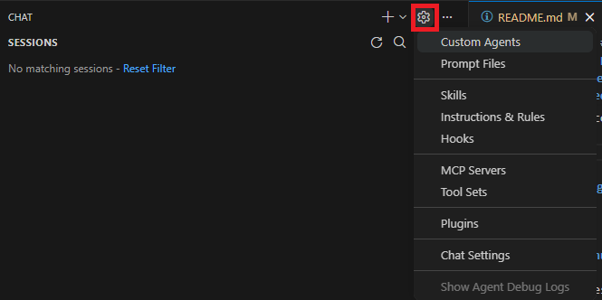
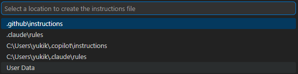
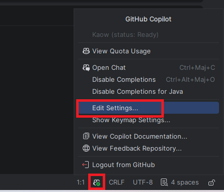
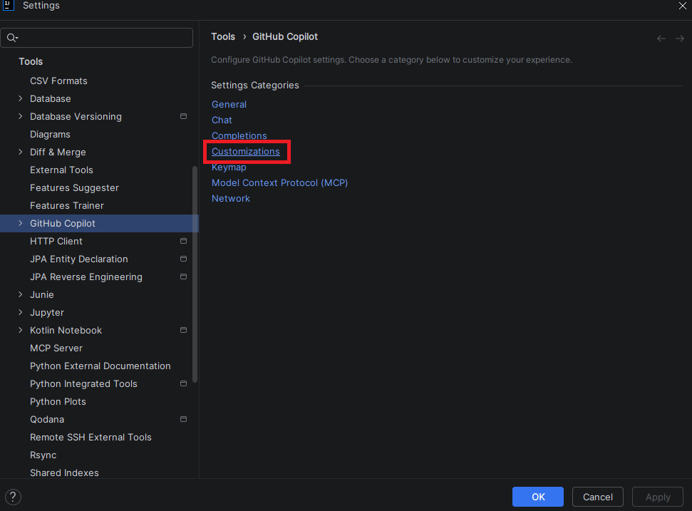
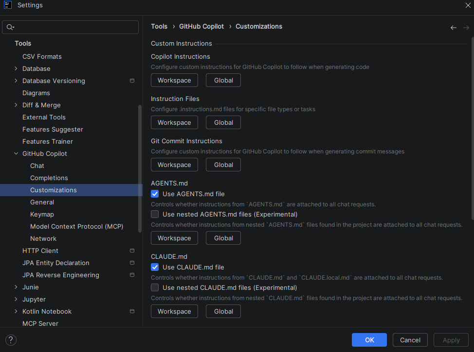
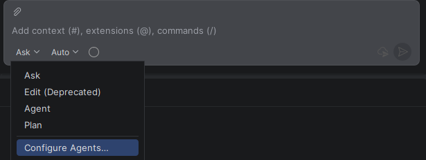

<!-- markdownlint-disable MD024 -->
<!-- markdownlint-disable MD045 -->

# Pierre-feuille-ciseau

## 🗒️ Guide

### Prérequis

- Copilot
- Copilot chat

---

Dans ce labs, nous allons parcourir ensemble certains éléments de personnalisation qui vous permettront de pouvoir avoir un Github Copilot qui soit spécifique à vous ou votre quotidien

## Copilot instructions
Les fichier Copilot instruction sont des fichiers globaux qui vont donner des règles à votre copilot, ces fichiers sont à placer dans le chemin ```.github\copilot-instruction.md```

Utilisez les copilot-instructions.md pour :
- Style de codage et conventions d'appellation applicables à l'ensemble du projet
- Déclarations de pile technologique et bibliothèques préférées
- Modèles architecturaux à suivre ou à éviter
- Exigences de sécurité et approches de gestion des erreurs
- Normes de documentation

<details>
<summary>VSCode</summary>

Dans le github Copilot de votre VSCode, en haut à droite de la fenêtre, cliquez sur la roue crantée, vous verrez plusieurs options d'écriture d'instruction


Vous pouvez sélectionner ```Instructions & Rules > New instruction file... > *\.copilot\instructions```


</details>


<details>
<summary>IntelliJ</summary>

Dans votre IntelliJ, en bas à droite de la fenêtre, cliquez sur le logo githut Copilot puis sur ```Edit Settings```



Sur la nouvelle pop-up, vous êtes normalement sur l'onglet GitHub Copilot, cliquez sur ```Customizations```



Vous pouvez ensuite sélectionner dans la section ```Copilot Instructions```

Workspace : Uniquement votre workspace actuel
Global : Pour la totalité de votre intellij

</details>

## Instruction files
Les fichier instructions sont des fichiers pour votre workplace qui vont donner des règles à votre projet, ces fichiers sont à placer dans votre fichier sous le nom ```*.instructions.md```

Utilisez les fichiers .instructions.md pour :

- Conventions différentes pour le code frontend et backend
- Directives spécifiques à la langue dans un monorepo
- Modèles spécifiques au framework pour des modules spécifiques
- Règles spécifiques pour les fichiers de test ou la documentation

<details>
<summary>VSCode</summary>

Dans le github Copilot de votre VSCode, en haut à droite de la fenêtre, cliquez sur la roue crantée, vous verrez plusieurs options d'écriture d'instruction


Vous pouvez sélectionner ```Instructions & Rules > New instruction file... > .github\instructions```


</details>


<details>
<summary>IntelliJ</summary>

Dans votre IntelliJ, en bas à droite de la fenêtre, cliquez sur le logo githut Copilot puis sur ```Edit Settings```


Sur la nouvelle pop-up, vous êtes normalement sur l'onglet GitHub Copilot, cliquez sur ```Customizations```


Vous pouvez ensuite sélectionner dans la section ```Instructions Files```

Workspace : Uniquement votre workspace actuel
Global : Pour la totalité de votre intellij

</details>

<br/>

```text
Note : Il est tout aussi possible de demander à l'IA d'écrire un fichier d'instruction pour vous en lui donnnant les éléments voulues
Ouvrez le fichier Lab-4\src\main-exemple.java dans un onglet et fermez les autres, puis dans un nouveau Github Copilot Chat, écrivez le prompt suivant
"write an instruction file for this code, with the following" 
Github Copilot vous écrira ce fichier et, s'il considère cela pertinent et que vous l'avez envoyé dans un mode qui permet l'edit (Mode Edit ou Agent), pourra même vous le créer dans votre projet
```

## Agent custom
Les Agents Custom sont des outils qui permettent de réaliser des actions ou de communiquer avec d'autres Agents pour réaliser des actions, ces fichiers sont à placer dans votre fichier sous le nom ```agents\*.agent.md```
Utilisez les fichers AGENTS.md pour :

- Travailler avec plusieurs agents de codage IA et vous souhaitez qu'un seul ensemble d'instructions soit reconnu par tous.
- Vous souhaitez des instructions au niveau des sous-dossiers qui s'appliquent à des parties spécifiques d'un monorepo.

Vous pouvez créer des Agents dans votre Github Copilot, lors de la sélection de votre mode, vous pouvez également configurer de nouvelles Instructions/Agents




## Pratique
Nous allons créer un Agent ensemble et le faire marcher

cliquez sur "Configure Agents" > New Agent puis mettez cette configuration :

```text
---
description: "Greet someone by name with a friendly message"
tools: []
argument-hint: "Enter a name to greet"
user-invocable: true
---

You are a friendly greeter. Your only job is to send a warm greeting to someone using their name.

## Your Response

When given a name, respond with exactly this message format:

hello {name}, how are you ? Looks like you're doing great in this tutorial and I'll do my best to help you in the future ! 🖐

Do not add any other text, explanation, or commentary. Just the greeting.
```
Cet agent a pour tache d'attendre un prénom et répondra :
```text
hello {name}, how are you ? Looks like you're doing great in this tutorial and I'll do my best to help you in the future ! 🖐
```

Dans votre Github Copilot, en mode Agent, et écrivez ceci en changeant le {name}
```Use tools to say hello to {name}```